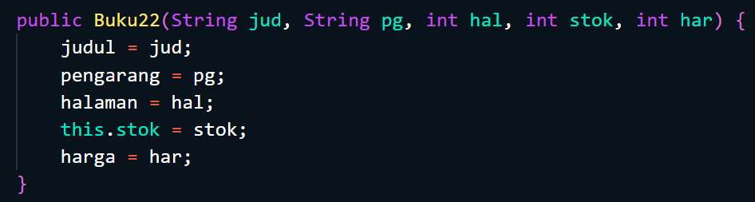

# Laporan Praktikum Pertemuan 2
<b>NAMA : Octrian Adiluhung TIto Putra<b> 
<b>KELAS : TI-1H<b> 
<b>ABSEN : 22<b> 
<b>NIM : 2341720078<b> 
 

## Percobaan 1 : Deklarasi Class, Atribut dan Method 
### OUTPUT : 
 

 
### Pertanyaan :
 
1. Sebutkan dua karakteristik class atau object! 
  - a. Encapsulation (Pengkapsulan) : Encapsulation mengacu pada konsep menyembunyikan rincian implementasi dari pengguna luar 
  b. Inheritance (Pewarisan) : Inheritance adalah mekanisme di mana kelas baru dapat dibuat dengan mewarisi sifat-sifat dan perilaku dari kelas yang sudah ada   
2. Perhatikan class Buku pada Praktikum 1 tersebut, ada berapa atribut yang dimiliki oleh class 
Buku? Sebutkan apa saja atributnya! 
  - Terdapat 5 atribut dalam class Buku, yaitu String judul, pengarang dan int halaman, stok, harga  
3. Ada berapa method yang dimiliki oleh class tersebut? Sebutkan apa saja methodnya! 
  - Terdapat 4 method yaitu, tampilInformasi(), terjual(int jml), restock(int jml), gantiHarga(int hrg)  
4. Perhatikan method terjual() yang terdapat di dalam class Buku. Modifikasi isi method tersebut 
sehingga proses pengurangan hanya dapat dilakukan jika stok masih ada (lebih besar dari 0)! 
   - KODE PROGRAM
  
  - OUTPUT
  
  
5. Menurut Anda, mengapa method restock() mempunyai satu parameter berupa bilangan int? 
  - Karena parameter tersebut digunakan untuk menentukan jumlah buku yang akan ditambahkan ke stok. Dengan menggunakan parameter bilangan integer, menentukan jumlah buku yang akan ditambahkan saat melakukan restock akan lebih gampang.  

## Percobaan 2: Instansiasi Object, serta Mengakses Atribut dan Method
### OUTPUT 
 

### Pertanyaan :
 
1. Pada class BukuMain, tunjukkan baris kode program yang digunakan untuk proses instansiasi! 
Apa nama object yang dihasilkan? 
  - Buku22 bk1 = new Buku22(); 
Buku22 bk2 = new Buku22 ("Self Reward", "Maheera Ayesha", 160, 29, 59000);
  Objek yang dihasilkan oleh kode pertama yaitu bk1, dan yang kedua yaitu bk2  
2. Bagaimana cara mengakses atribut dan method dari suatu objek? 
  - Untuk mengakses atribut dari objek, dapat dengan cara menggunakan nama objek diikuti dengan tanda titik dan nama atribut yang ingin diakses 
- Untuk memanggil method dari objek, dapat dengan cara menggunakan nama objek diikuti dengan tanda titik dan nama method yang ingin dipanggil, kemudian diikuti dengan argumen-argumen yang diperlukan jika ada  
3. Mengapa hasil output pemanggilan method tampilInformasi() pertama dan kedua berbeda?
  - Karena ada perubahan nilai pada atribut objek bk1
  

## Percobaan 3: Membuat Konstruktor
### OUTPUT
 

### Pertanyaan
 
1. Pada class Buku di Percobaan 3, tunjukkan baris kode program yang digunakan untuk
mendeklarasikan konstruktor berparameter! 
   
  
2. Perhatikan class BukuMain. Apa sebenarnya yang dilakukan pada baris program berikut?
  - Mendeklarasikan sebuah konstruktor untuk class Buku22
  
3. Hapus konstruktor default pada class Buku, kemudian compile dan run program. Bagaimana 
hasilnya? Jelaskan mengapa hasilnya demikian!
  - Terjadi error karena tidak ada konstruktor tanpa parameter yang tersedia untuk digunakan saat membuat objek.  
4. Setelah melakukan instansiasi object, apakah method di dalam class Buku harus diakses
secara berurutan? Jelaskan alasannya! 
  - Tidak karena setiap method memiliki fungsi yang berbeda, dan urutan method tidak mempengaruhi urutan kode dijalankan. Sehingga kita bisa mengakses method sesuai dengan kebutuhan
  
5. Buat object baru dengan nama buku<NamaMahasiswa> menggunakan konstruktor 
berparameter dari class Buku!
  - KODE PROGRAM
  
  - OUTPUT
 

  

### LATIHAN PRAKTIKUM - 1
KODE PROGRAM
 

 
OUTPUT
 

### LATIHAN PRAKTIKUM - 2
KODE PROGRAM
 

 
OUTPUT
 
