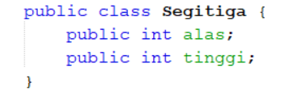
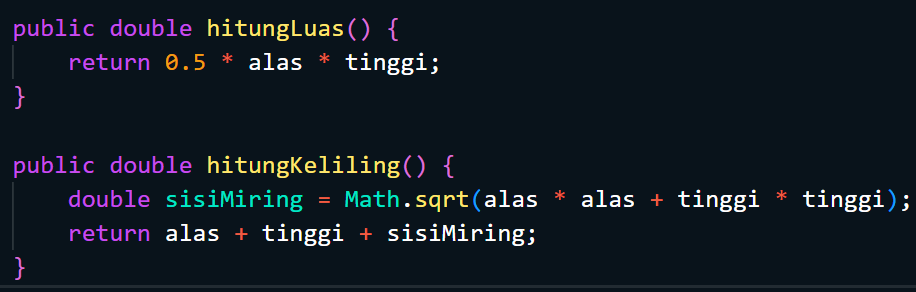

# Laporan Praktikum Pertemuan 3
<b>NAMA : Octrian Adiluhung TIto Putra<b> 
<b>KELAS : TI-1H<b> 
<b>ABSEN : 22<b> 
<b>NIM : 2341720078<b> 
 

## Percobaan 1 : : Membuat Array dari Object, Mengisi dan Menampilkan 
### OUTPUT : 
 

 
Pertanyaan :
 
1. Berdasarkan uji coba 3.2, apakah class yang akan dibuat array of object harus selalu memiliki
atribut dan sekaligus method?Jelaskan!
 
- Tidak, sebuah class yang akan digunakan untuk membuat array of objects tidak harus memiliki atribut dan method secara wajib. Kehadiran atribut dan method tergantung pada kebutuhan fungsionalitas dari objek yang direpresentasikan oleh class tersebut.
  
2. Apakah class PersegiPanjang memiliki konstruktor?Jika tidak, kenapa dilakukan pemanggilan
konstruktur pada baris program berikut :
 

 
- Ya, class PersegiPanjang memiliki konstruktor default secara implisit yang disediakan oleh Java. Meskipun konstruktor tidak didefinisikan secara eksplisit dalam kode, Java akan menyediakan konstruktor default secara otomatis jika tidak ada konstruktor lain yang didefinisikan.
  
3. Apa yang dimaksud dengan kode berikut ini :
 

 
- Kode tersebut merupakan inisialisasi dari sebuah array objek dari kelas PersegiPanjang dengan length array 3.
  
4. Apa yang dimaksud dengan kode berikut ini :
 

 
- Baris kode tersebut merupakan proses pembuatan object dan mengisi atribut dari object tersebut
  
5. Mengapa class main dan juga class PersegiPanjang dipisahkan pada uji coba 3.2?
 
- Karena class PersegiPanjang merupakan konstruktor object
 

## Percobaan 2: Menerima Input Isian Array Menggunakan Looping
### OUTPUT
 

 
Pertanyaan
 
1. Apakah array of object dapat diimplementasikan pada array 2 Dimensi?
 
- Ya, array of object dapat diimplementasikan dalam array 2 dimensi. Dalam konteks ini, array 2 dimensi akan menjadi array yang berisi objek-objek, di mana setiap elemen dari array utama adalah array lagi yang berisi objek-objek.
  
2. Jika jawaban soal no satu iya, berikan contohnya! Jika tidak, jelaskan!
 

  
3. Jika diketahui terdapat class Persegi yang memiliki atribut sisi bertipe integer, maka kode
dibawah ini akan memunculkan error saat dijalankan. Mengapa?
 

 
- Objek tersebut belum diinstansiasi
  
4. Modifikasi kode program pada praktikum 3.3 agar length array menjadi inputan dengan Scanner!
 

  
5. Apakah boleh Jika terjadi duplikasi instansiasi array of objek, misalkan saja instansiasi dilakukan
pada ppArray[i] sekaligus ppArray[0]? Jelaskan !
 
- Boleh jika proses instansiasi menggunakan looping. Jika tidak,maka akan mendapatkan kompilasi yang menghasilkan eror
 

## Percobaan 3: Penambahan Operasi Matematika di Dalam Method
### OUTPUT
 

 
Pertanyaan :
 
1. Dapatkah konstruktor berjumlah lebih dalam satu kelas? Jelaskan dengan contoh!
 
- Bisa, contohnya : 

  
2. Jika diketahui terdapat class Segitiga seperti berikut ini :
 

Tambahkan konstruktor pada class Segitiga tersebut yang berisi parameter int a, int t
yang masing-masing digunakan untuk mengisikan atribut alas dan tinggi.
 

  
3. Tambahkan method hitungLuas() dan hitungKeliling() pada class Segitiga
tersebut. Asumsi segitiga adalah segitiga siku-siku. (Hint: Anda dapat menggunakan bantuan
library Math pada Java untuk mengkalkulasi sisi miring)
 
-
  
4. Pada fungsi main, buat array Segitiga sgArray yang berisi 4 elemen, isikan masing-masing
atributnya sebagai berikut:
sgArray ke-0 alas: 10, tinggi: 4
sgArray ke-1 alas: 20, tinggi: 10
sgArray ke-2 alas: 15, tinggi: 6
sgArray ke-3 alas: 25, tinggi: 10
 

  
5. Kemudian menggunakan looping, cetak luas dan keliling dengan cara memanggil method
hitungLuas() dan hitungKeliling().
 

 

## Latihan Praktikum - 1
### OUTPUT
 

 

## Latihan Praktikum - 2
### OUTPUT
 

 

## Latihan Praktikum - 3
### OUTPUT
 

 
