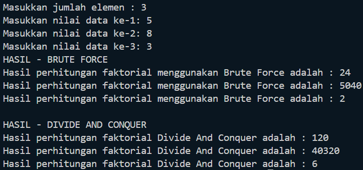
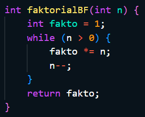
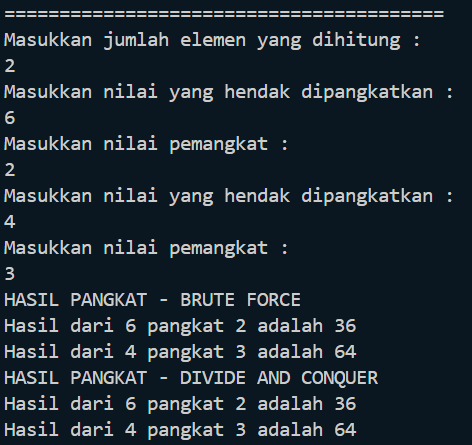
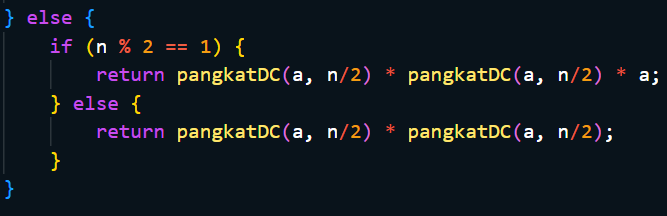
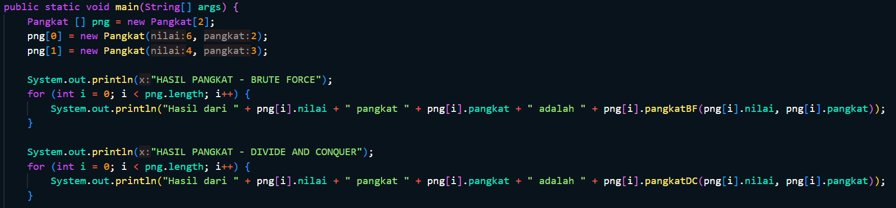
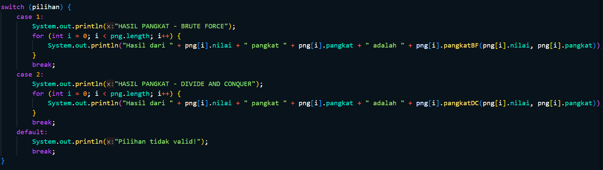
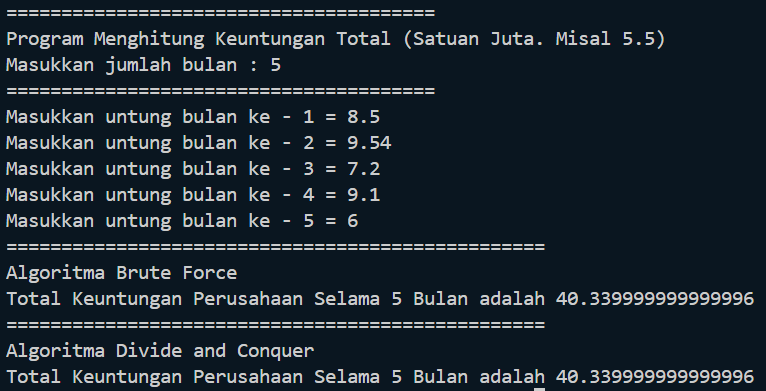
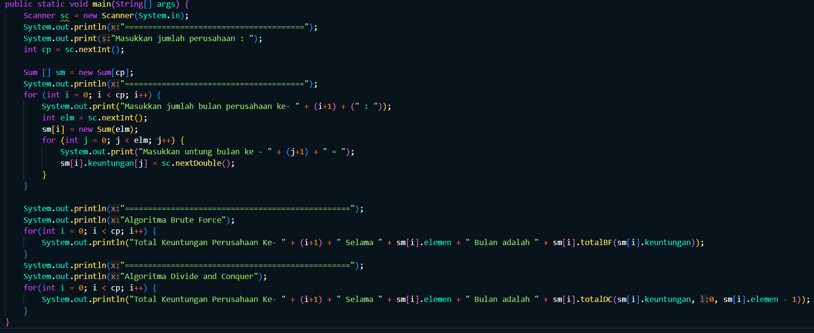
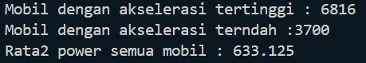

# Laporan Praktikum Pertemuan 3
<b>NAMA : Octrian Adiluhung TIto Putra<b> 
<b>KELAS : TI-1H<b> 
<b>ABSEN : 22<b> 
<b>NIM : 2341720078<b> 
 

## Percobaan 1 : Menghitung Nilai Faktorial dengan Algoritma Brute Force dan Divide and Conquer
### OUTPUT
 

 
Pertanyaan
 
1. Pada base line Algoritma Divide Conquer untuk melakukan pencarian nilai faktorial, jelaskan
perbedaan bagian kode pada penggunaan if dan else!
  
- if digunakan untuk mengecek apakah nilai n sudah mencapai base case. Kasus dasar terjadi ketika n adalah 1, karena faktorial dari 1 adalah 1 itu sendiri (1!= 1). Ketika kasus dasar terpenuhi, fungsi langsung mengembalikan nilai 1 tanpa perlu melakukan rekursi lebih lanjut 
Bagian else aktif ketika nilai n lebih besar dari 1, artinya base case belum terpenuhi dan perhitungan faktorial masih perlu dilakukan. Pada bagian ini fungsi memanggil dirinya sendiri (faktorialDC(n - 1)) dengan nilai n yang dikurangi 1. Hasil dari pemanggilan rekursif tersebut kemudian dikalikan dengan n saat ini untuk mendapatkan faktorial dari n. Proses ini terus berulang hingga mencapai base case yg ditetapkan pada bagian if, di mana akhirnya akan dikembalikan nilai faktorial dari n.
   
2. Apakah memungkinkan perulangan pada method faktorialBF() dirubah selain menggunakan
for?Buktikan!
  
- Perulangan pada method faktorialBF bisa menggunakan while loop dan do while loop juga, berikut kode nya :
 

   
3. Jelaskan perbedaan antara fakto *= i; dan int fakto = n * faktorialDC(n-1); !
  
- fakto *= i; yang menggunakan algoritma brute force mengandalkan iterasi dan pengulangan langsung melalui loop, sementara int fakto = n * faktorialDC(n-1); yang menggunakan algoritma divide and conquer menggunakan pemanggilan fungsi rekursif untuk mencapai hasil.
   

## Percobaan 2 : Menghitung Hasil Pangkat dengan Algoritma Brute Force dan Divide and Conquer
### OUTPUT
 

 
Pertanyaan
 
1. Jelaskan mengenai perbedaan 2 method yang dibuat yaitu PangkatBF() dan PangkatDC()!
  
- Dalam metode PangkatBF() ini, perhitungan dilakukan dengan mengalikan bilangan dasar (a) sebanyak n kali secara berulang. Jika n adalah pangkat yang diinginkan, maka loop for akan berjalan n kali, dan pada setiap iterasi, hasil yang sedang diakumulasi (hasil) akan dikalikan dengan bilangan dasar (a).
 
- Dalam metode PangkatDC() ini, masalah dipecah menjadi sub-masalah yang lebih kecil. Jika n genap, bilangan dasar (a) dipangkatkan ke n/2, dan hasilnya dikalikan dengan dirinya sendiri. Jika n ganjil, proses yang sama dilakukan, tetapi hasilnya kemudian dikalikan sekali lagi dengan bilangan dasar (a) untuk memperhitungkan faktor ganjil tersebut.
   
2. Apakah tahap combine sudah termasuk dalam kode tersebut?Tunjukkan!
  
- Tahap combine terjadi ketika hasil dari pemanggilan fungsi pangkatDC kepada dirinya sendiri dengan n/2.  

 
Untuk kasus genap (n % 2 == 0), solusi dari sub-problem dikalikan satu sama lain (pangkatDC(a, n/2) * pangkatDC(a, n/2)). 
Untuk kasus ganjil (n % 2 == 1), karena satu faktor a tersisa setelah pembagian, kita perlu mengalikan hasil rekursi yang telah dikalikan dengan a sekali lagi (pangkatDC(a, n/2) * pangkatDC(a, n/2) * a).
 Ini menunjukkan bagaimana tahap combine bekerja dalam pangkatDC
   
3. Modifikasi kode program tersebut, anggap proses pengisian atribut dilakukan dengan
konstruktor.
  

   
4. Tambahkan menu agar salah satu method yang terpilih saja yang akan dijalankan menggunakan
switch-case!
  

   

## Percobaan 3 : Menghitung Sum Array dengan Algoritma Brute Force dan Divide and Conquer
### OUTPUT
 

 
Pertanyaan
 
1. Mengapa terdapat formulasi return value berikut?Jelaskan!
  
- Formulasi return tersebut menunjukkan tahap combine dalam algoritma Divide and Conquer untuk menggabungkan hasil dari dua sub-problem yang lebih kecil
   
2. Kenapa dibutuhkan variable mid pada method TotalDC()?
  
- Karena merupakan titik tengah dari rentang yang sedang diproses. Ini adalah titik pembagi yang membagi rentang array menjadi dua sub array yang lebih kecil saat menggunakan pendekatan Divide and Conquer
   
3. Program perhitungan keuntungan suatu perusahaan ini hanya untuk satu perusahaan saja.
Bagaimana cara menghitung sekaligus keuntungan beberapa bulan untuk beberapa
perusahaan.(Setiap perusahaan bisa saja memiliki jumlah bulan berbeda-beda)? Buktikan
dengan program!
  

   

## Latihan Praktikum
### OUTPUT
 

 