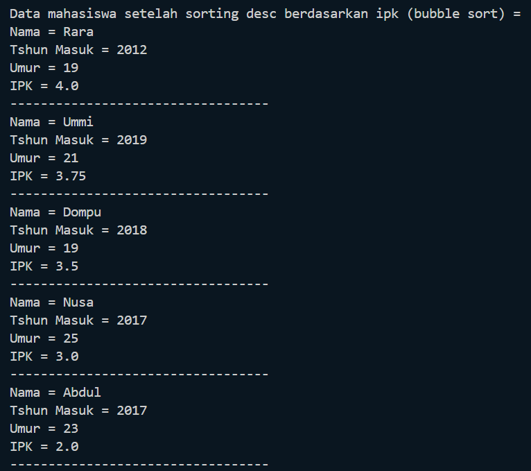
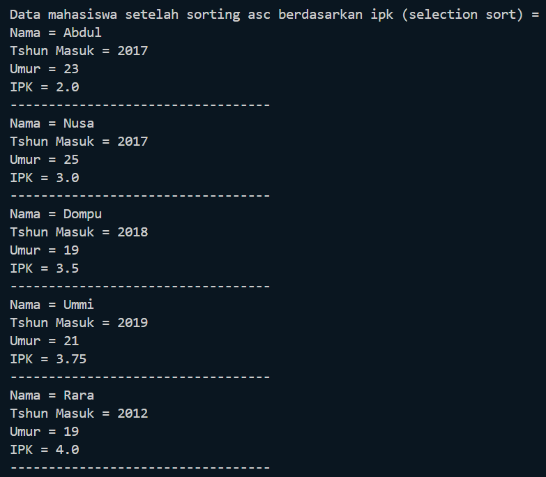
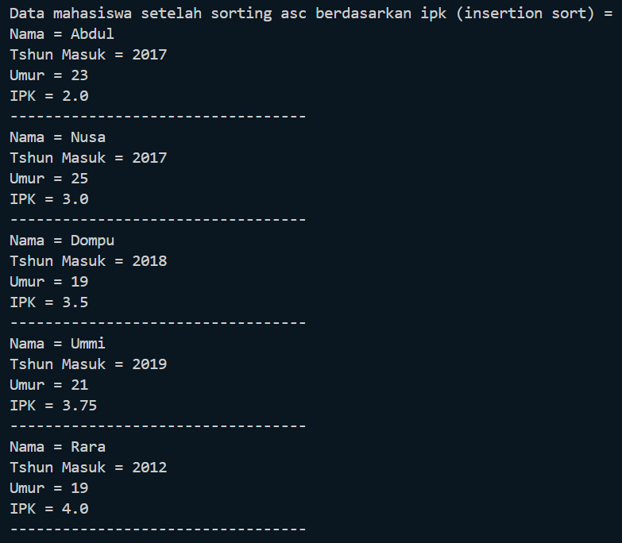
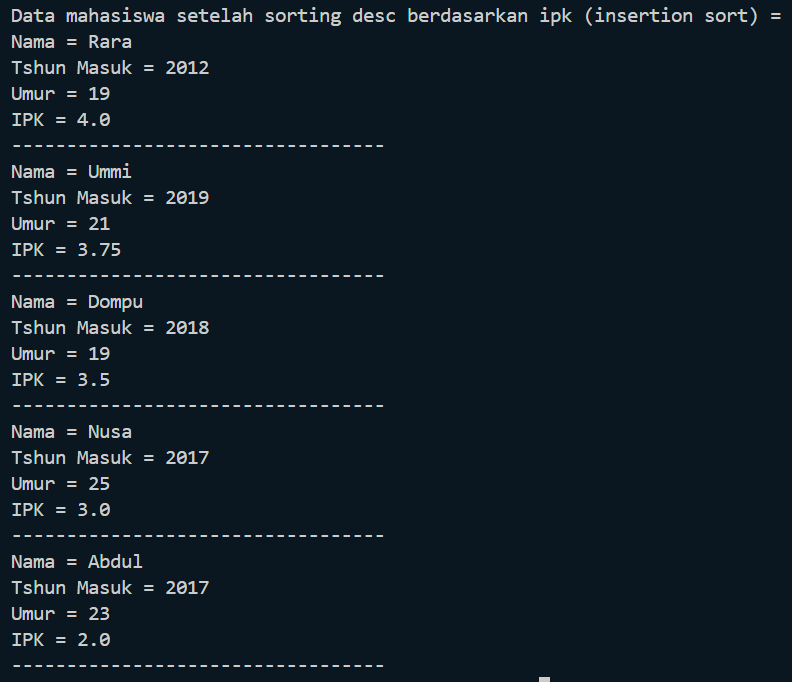
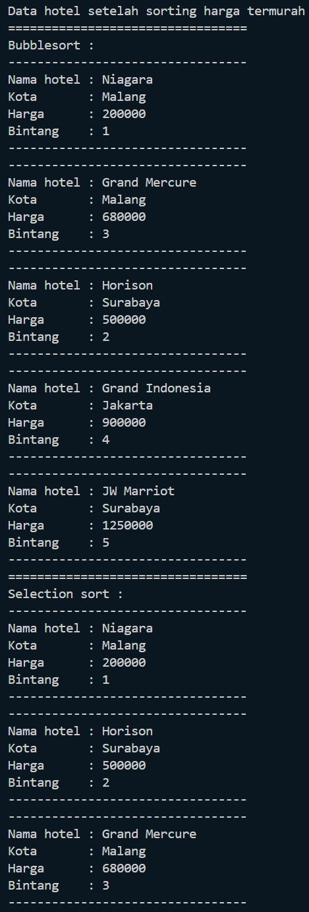
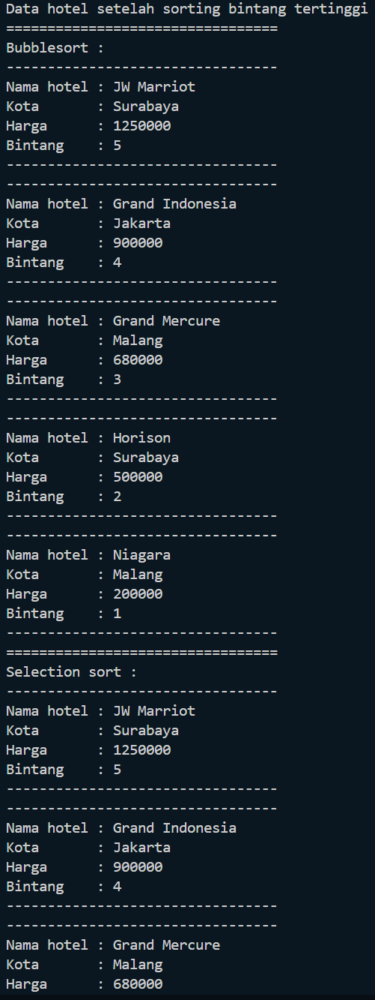

# Laporan Praktikum 5
<b>NAMA : Octrian Adiluhung TIto Putra<b> 
<b>KELAS : TI-1H<b> 
<b>ABSEN : 22<b> 
<b>NIM : 2341720078<b> 
 

## Percobaan 1 : Mengurutkan Data Mahasiswa Berdasarkan IPK Menggunakan Bubble Sort
### OUTPUT
 

 
Pertanyaan

 
1. Terdapat di method apakah proses bubble sort?
  
- Dalam method bubbleSort di class daftarMahasiswaBerprestasi
   
2. Di dalam method bubbleSort(), terdapat baris program seperti di bawah ini:
Untuk apakah proses tersebut?
  
- Sebagai proses penukaran urutan dari yang tertinggi ke terendah
   
3. Perhatikan perulangan di dalam bubbleSort() di bawah ini:
 
a. Apakah perbedaan antara kegunaan perulangan i dan perulangan j?
  
- Perulangan i digunakan untuk jumlah pengulangan pengurutan yang dilakukan pengulangan j, yang mana pengulangan j akan dilakukan untuk mengurutkan dari yang tertinggi ke terendah
   
b. Mengapa syarat dari perulangan i adalah i<listMhs.length-1> ?
  
- Karena jika semua angka telah diurutkan, maka angka terakhir akan menjadi angka yang terkecil secara sendirinya.
   
c. Mengapa syarat dari perulangan j adalah j<listMhs.length-i> ?
  
- Karena setelah pengurutan di pengulangan j telah dilakukan semua, angka pertama akan menjadi angka terbesar
   
d. Jika banyak data di dalam listMhs adalah 50, maka berapakali perulangan i akan
berlangsung? Dan ada berapa Tahap bubble sort yang ditempuh?
  
- Sebanyak 49 perulangan i yang akan terjadi, dan akan ada sejumlah perulangan i tahap bubble sort yang akan ditempuh
   

## Percobaan 2 :  Mengurutkan Data Mahasiswa Berdasarkan IPK Menggunakan Selection Sort
### OUTPUT
 

 
Pertanyaan
 
1. Di dalam method selection sort, terdapat baris program seperti di bawah ini:
Untuk apakah proses tersebut, jelaskan!
  
- Untuk mencari index dari nilai yang terendah
   

## Percobaan 3 :  Mengurutkan Data Mahasiswa Berdasarkan IPK Menggunakan Insertion Sort
### OUTPUT
 

 
Pertanyaan
 
1. Ubahlah fungsi pada InsertionSort sehingga fungsi ini dapat melaksanakan proses sorting
dengan cara descending.
  

   

## Latihan Praktikum
### OUTPUT
 

  
