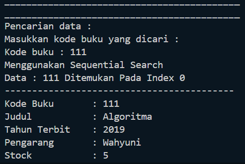
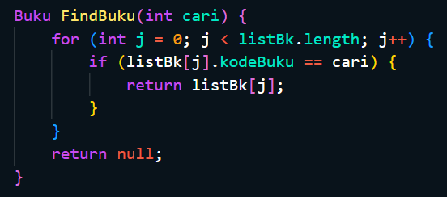
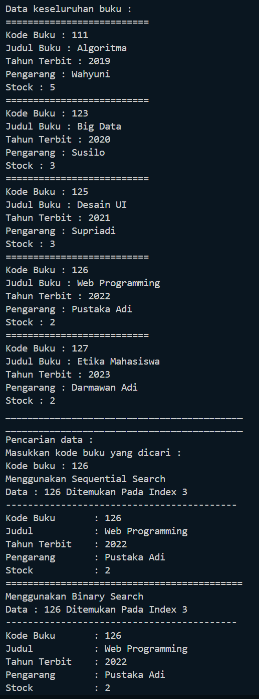
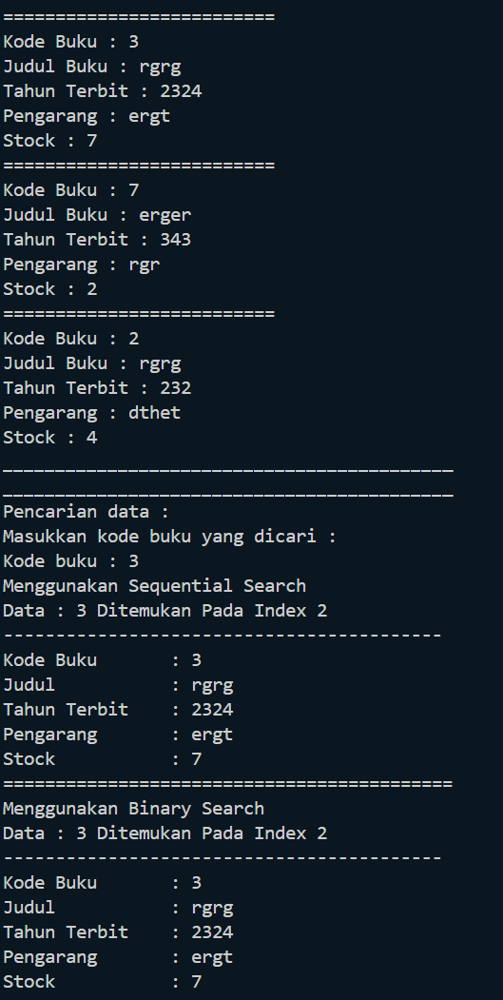
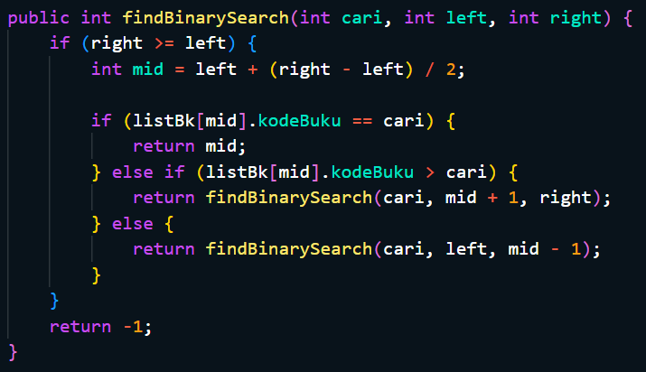
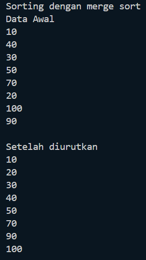
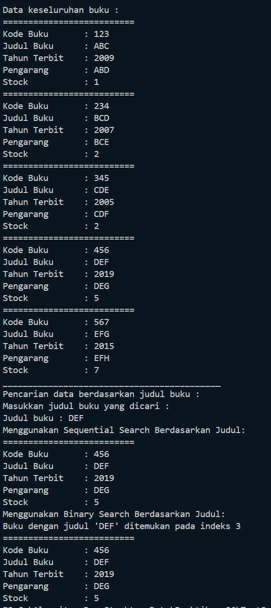

# Laporan Praktikum 5
<b>NAMA : Octrian Adiluhung TIto Putra<b> 
<b>KELAS : TI-1H<b> 
<b>ABSEN : 22<b> 
<b>NIM : 2341720078<b> 
 

## Percobaan 1 : Sequential Search
### OUTPUT
 

 
Pertanyaan
 
1. Jelaskan fungsi break yang ada pada method FindSeqSearch!
  
- Menghentikan perulangan for jika data yang dicari sudah ditemukan
   
2. Jika Data Kode Buku yang dimasukkan tidak terurut dari kecil ke besar. Apakah program masih
dapat berjalan? Apakah hasil yang dikeluarkan benar? Tunjukkan hasil screenshoot untuk bukti
dengan kode Buku yang acak. Jelaskan Mengapa hal tersebut bisa terjadi?
   
  
- Kode program masih bisa berjalan, karena data yang tersusun atau teracak tidak mempengaruhi kode program.
   
3. Buat method baru dengan nama FindBuku menggunakan konsep sequential search dengan tipe
method dari FindBuku adalah BukuNoAbsen. Sehingga Anda bisa memanggil method
tersebut pada class BukuMain seperti gambar berikut :
  

   

## Percobaan 2 :  Pencarian Menggunakan Binary Search
### OUTPUT
 

 
Pertanyaan
 
1. Tunjukkan pada kode program yang mana proses divide dijalankan!
  
- int mid = (left + right) / 2;
   
2. Tunjukkan pada kode program yang mana proses conquer dijalankan!
  
else if (listBk[mid].kodeBuku > cari) { 
    return findBinarySearch(cari, left, mid - 1); 
} else { 
    return findBinarySearch(cari, mid + 1, right); 
}
   
3. Jika data Kode Buku yang dimasukkan tidak urut. Apakah program masih dapat berjalan? Mengapa
demikian! Tunjukkan hasil screenshoot untuk bukti dengan kode Buku yang acak. Jelaskan
Mengapa hal tersebut bisa terjadi?
  

 
- Program akan tetap berjalan, hanya saja data yang ada tidak berurutan. Hal ini dapat terjadi karena data yang berurutan tidak mempengaruhi binary dan sequential search, jika kode buku ditemukan maka akan ditamapilkan.
   
4. Jika Kode Buku yang dimasukkan dari Kode Buku terbesar ke terkecil (missal : 20215, 20214,
20212, 20211, 20210) dan elemen yang dicari adalah 20210. Bagaimana hasil dari binary search?
Apakah sesuai? Jika tidak sesuai maka ubahlah kode program binary seach agar hasilnya sesuai!
  

   

## Percobaan 3 :  Percobaan Pengayaan Divide and Conquer
### OUTPUT
 

  

## Latihan Praktikum
### OUTPUT
 

