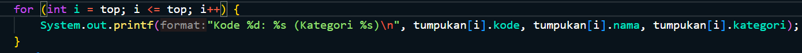
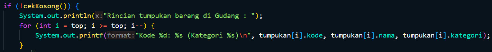
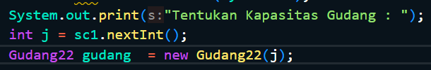

# Laporan Praktikum 8
<b>NAMA : Octrian Adiluhung TIto Putra<b> 
<b>KELAS : TI-1H<b> 
<b>ABSEN : 22<b> 
<b>NIM : 2341720078<b> 
 

## Percobaan 1 :  Penyimpanan Tumpukan Barang dalam Gudang
### OUTPUT
 

 
Pertanyaan
 
1. Lakukan perbaikan pada kode program, sehingga keluaran yang dihasilkan sama dengan verifikasi 
hasil percobaan! Bagian mana saja yang perlu diperbaiki?  
  
- Bagian yang harus diperbaiki yaitu
 
  
Menjadi : 

  
2. Berapa banyak data barang yang dapat ditampung di dalam tumpukan? Tunjukkan potongan kode 
programnya!  
- Data yang dapat ditampung sebanyak 7 data
  
3. Mengapa perlu pengecekan kondisi !cekKosong() pada method tampilkanBarang? Kalau kondisi 
tersebut dihapus, apa dampaknya?  
- Diperlukan pengecekan tersebut untuk mengecek apakah terdapat barang di gudang atau tidak. Jika kondisi tersebut dihapus saat tidak terdapat barang di gudang, maka tidak ada output yang dihasilkan atau tidak ada informasi kalau gudang sedang kosong.
  
4. Modifikasi kode program pada class Utama sehingga pengguna juga dapat memilih operasi lihat 
barang teratas, serta dapat secara bebas menentukan kapasitas gudang!
 

 

  

## Percobaan 2 : Konversi Kode Barang ke Biner 
 

 
Pertanyaan
 
1. Pada method konversiDesimalKeBiner, ubah kondisi perulangan menjadi while (kode != 0), 
bagaimana hasilnya? Jelaskan alasannya!  
- Program masih dapat berjalan. Hal tersebut terjadi karena nilai dari kode barang yang dihapus bernilai min(-). Jika memakai kode > 0, maka output dari kode uniknya null.
  
2. Jelaskan alur kerja dari method konversiDesimalKeBiner! 
- Nilai yang dimasukkan dari parameter akan dicek apakah nilainya > 0 atau tidak, jika nilai > 0 maka akan melakukan perulangan. Selanjutnya nilai tersebut akan di modulus dengan 2 dan dimasukkan ke dalam variabel sisa, lalu nilainya akan di push pada method push di object stack. Setelah itu akan dibagi dengan dua dan perulangan kembali dilakukan sampai nilainya 0. Lalu program mengecek apakah stack di object kosong atau tidak, jika ada isinya maka tumpukan biner teratas akan dimasukkan pada variabel biner dan program akan mengembalikan nilai dari variabel biner tersebut.
  

## Percobaan 3 :  Konversi Notasi Infix ke Postfix
 

 
Pertanyaan
 
1. Pada method derajat, mengapa return value beberapa case bernilai sama? Apabila return 
value diubah dengan nilai berbeda-beda setiap case-nya, apa yang terjadi?  
- Beberapa case memiliki return value yang sama karena kedudukannya prioritasnya yang setara seperti * dan /. Jika return valuenya diubah dengan nilai berbeda-beda maka kedudukan dari setiap operator akan berbeda-beda yang dimana akan menimbulkan error dalam konversi postfixnya
  
2. Jelaskan alur kerja method konversi!  
- Variabel P digunakan untuk menyimpan hasil dari stack yang sudah diproses di variabel c. Program melakukan perulangan sebanyak n (panjang dari String Q). char ke i pada String Q akan dimasukkan ke variabel c untuk diproses. dan prosesnya sebagai berikut : 
a. Jika adalah operand, maka langsung ditambahkan ke variabel P
 
b. Jika c adalah '(', maka ditambahkan ke stack menggunakan method push().
 
c. jika c adalah ')', maka semua karakter pada stack ditambahkan pada variabel P sampai '(' ditemukan dan '(' kemudian dihapus dari stack dengan method pop().
 
d. jika c adalah operator, maka char operator pada stack dengan kedudukan prioritas yang lebih tinggi ditambah di variabel P sampai char operator yang lebih rendah atau sama ditemukan dan operator tersebut kemudian ditambahkan menggunakan method push(). 
e. Setelah semua iterasi selesai, method mereturn nilai pada variabel P
  
3. Pada method konversi, apa fungsi dari potongan kode berikut? 
- Memasukkan char ke i pada String Q ke dalam variabel c (i sesuai dengan iterasinya dalam perulangan)
  

## Latihan Praktikum
### OUTPUT
 

  
