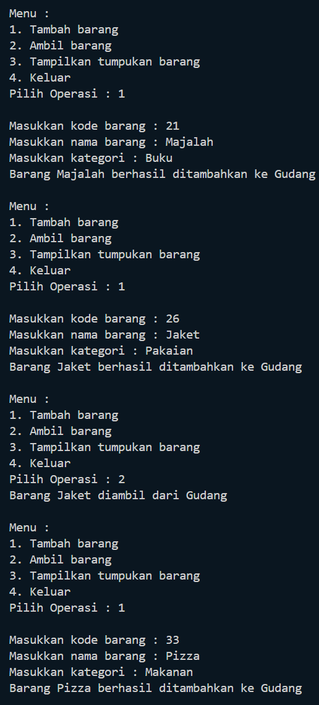
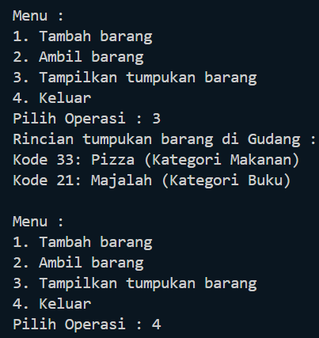
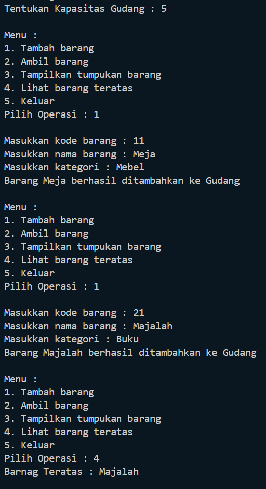
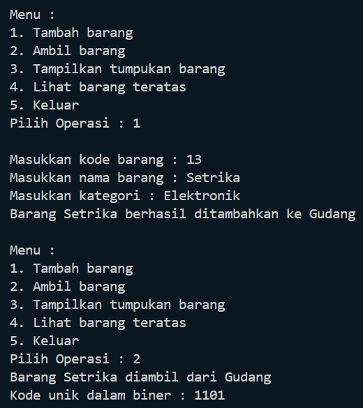
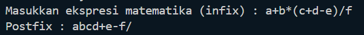
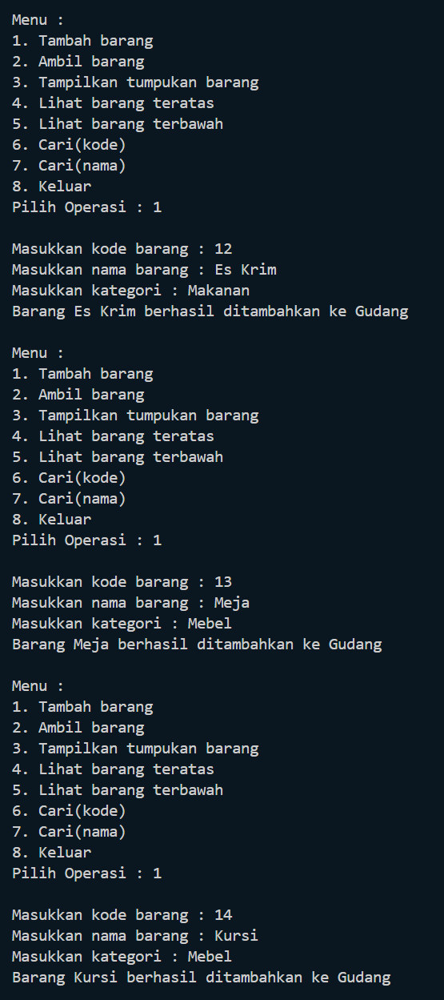
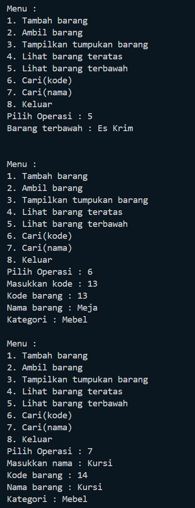

# Laporan Praktikum 8
<b>NAMA : Octrian Adiluhung TIto Putra<b> 
<b>KELAS : TI-1H<b> 
<b>ABSEN : 22<b> 
<b>NIM : 2341720078<b> 
 

## Percobaan 1 :  Penyimpanan Tumpukan Barang dalam Gudang
### OUTPUT
 

 
Pertanyaan
 
1. Lakukan perbaikan pada kode program, sehingga keluaran yang dihasilkan sama dengan verifikasi 
hasil percobaan! Bagian mana saja yang perlu diperbaiki?  
  
- Bagian yang harus diperbaiki yaitu
 

  
2. Berapa banyak data barang yang dapat ditampung di dalam tumpukan? Tunjukkan potongan kode 
programnya!  
- 
  
3. Mengapa perlu pengecekan kondisi !cekKosong() pada method tampilkanBarang? Kalau kondisi 
tersebut dihapus, apa dampaknya?  
- 
  
4. Modifikasi kode program pada class Utama sehingga pengguna juga dapat memilih operasi lihat 
barang teratas, serta dapat secara bebas menentukan kapasitas gudang!
 

 

  

## Percobaan 2 : Konversi Kode Barang ke Biner 
 

 
Pertanyaan
 
1. Pada method konversiDesimalKeBiner, ubah kondisi perulangan menjadi while (kode != 0), 
bagaimana hasilnya? Jelaskan alasannya!  
- 
  
2. Jelaskan alur kerja dari method konversiDesimalKeBiner! 
- 
  

## Percobaan 3 :  Konversi Notasi Infix ke Postfix
 

 
Pertanyaan
 
1. Pada method derajat, mengapa return value beberapa case bernilai sama? Apabila return 
value diubah dengan nilai berbeda-beda setiap case-nya, apa yang terjadi?  
- 
  
2. Jelaskan alur kerja method konversi!  
- 
  
3. Pada method konversi, apa fungsi dari potongan kode berikut? 
- 
  

## Latihan Praktikum
### OUTPUT
 

  
