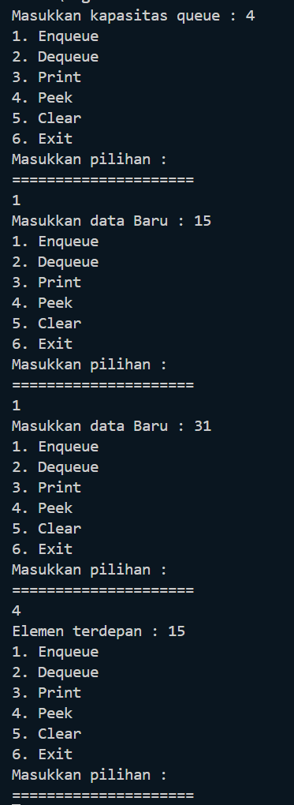
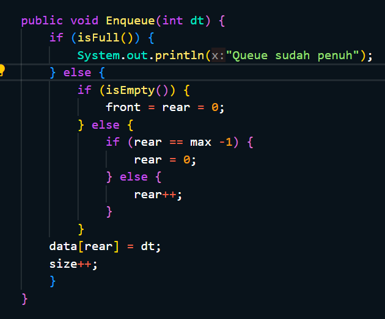
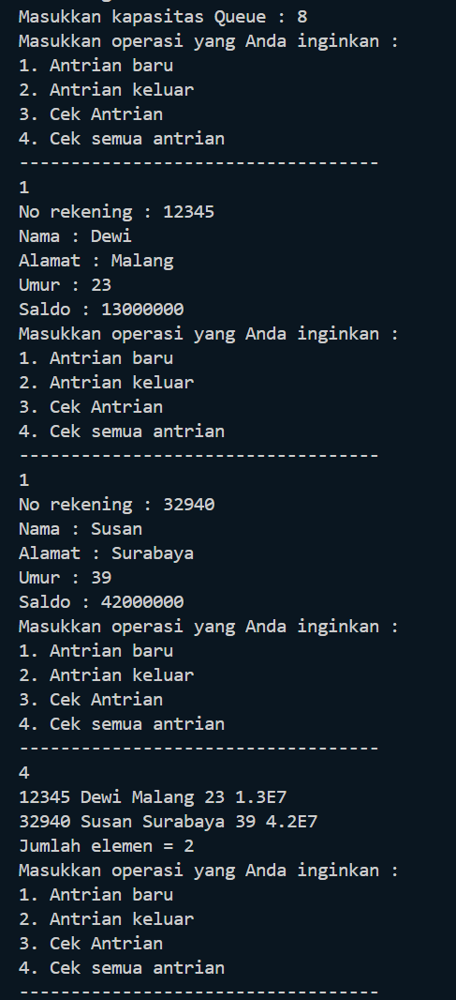
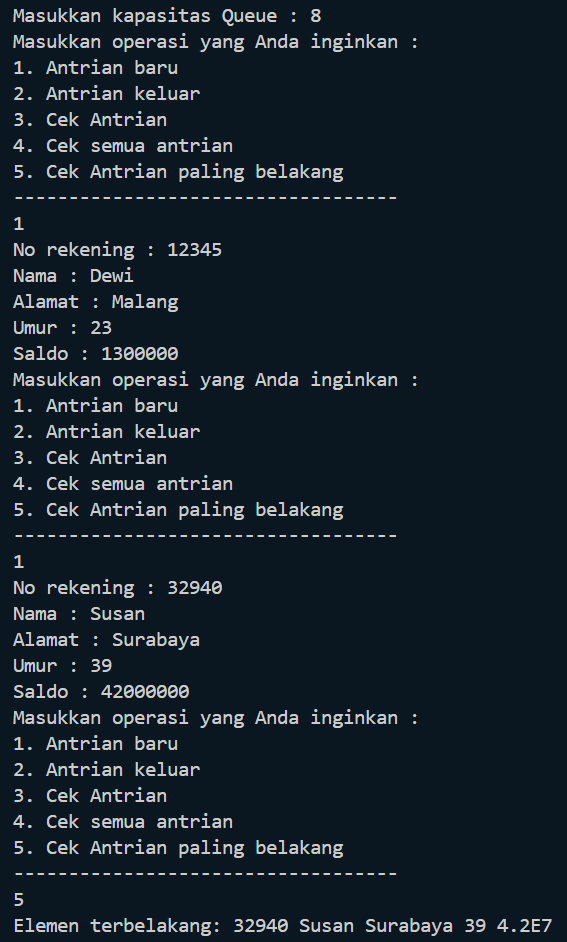
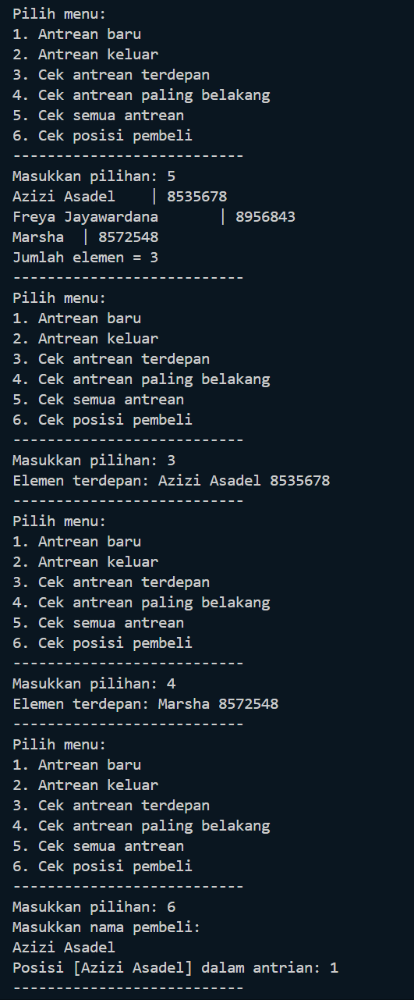
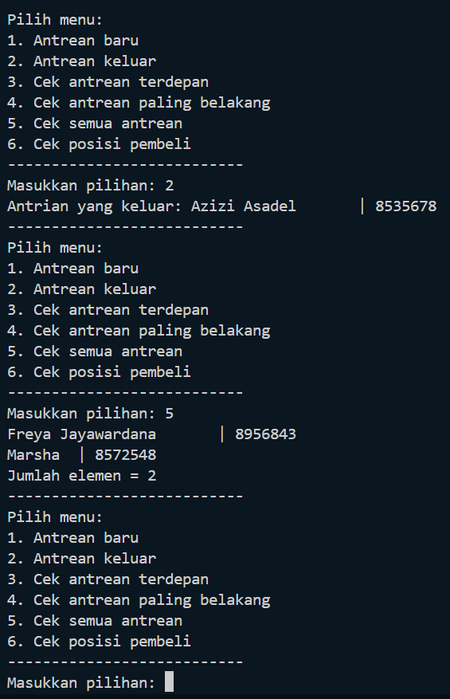

# Laporan Praktikum 9
<b>NAMA : Octrian Adiluhung TIto Putra<b><br>
<b>KELAS : TI-1H<b><br>
<b>ABSEN : 22<b><br>
<b>NIM : 2341720078<b><br>
<br>

## Percobaan 1
### OUTPUT
<br>

<br>
Pertanyaan
<br>
1. Pada konstruktor, mengapa nilai awal atribut front dan rear bernilai -1, sementara atribut size 
bernilai 0? <br>
- Atribut front dan rear diatur ke nilai -1 untuk menunjukkan bahwa kondisi antrian pada awalnya adalah kosong, sehingga tidak ada elemen yang terletak di depan atau belakang antrian. 
Sedangkan atribut size diatur ke nilai 0 untuk menunjukkan bahwa pada awalnya tidak ada elemen yang ada dalam antrian.
<br><br>
2. Pada method Enqueue, jelaskan maksud dan kegunaan dari potongan kode berikut! <br>
- kode if (rear == max - 1) { rear = 0; } digunakan untuk menangani kondisi saat rear telah mencapai indeks maksimum. Ketika rear mencapai indeks maksimum (max - 1), namun masih ada ruang kosong di depan antrian karena ada elemen yang di-dequeue sebelumnya, maka penambahan elemen baru akan dimulai kembali dari indeks awal array.
<br><br>
3. Pada method Dequeue, jelaskan maksud dan kegunaan dari potongan kode berikut! <br>
- Saat  men-dequeue elemen dari antrian, maka kita akan menggeser posisi front ke depan. Namun, saat front mencapai indeks maksimum (max - 1), dan masih ada elemen yang tersisa di belakang antrian, maka kita perlu kembali ke indeks awal array untuk menempatkan front. Dengan mengatur front kembali ke 0, hal tersebut memastikan bahwa meskipun kita telah melewati indeks maksimum array, kita masih dapat mengakses elemen-elemen yang ada di bagian awal array.
<br><br>
4. Pada method print, mengapa pada proses perulangan variabel i tidak dimulai dari 0 (int i=0), 
melainkan int i=front? <br>
- Perulangan dimulai dari nilai front ksupaya elemen-elemen antrian tecetak secara urut, dimulai dari elemen yang berada di depan antrian (berdasarkan nilai front). Kalau perulangan dimulai dari nilai 0, kita tidak dapat menjamin urutan yang benar dalam mencetak elemen-elemen antrian.
<br><br>
5. Perhatikan kembali method print, jelaskan maksud dari potongan kode berikut! <br>
- i = (i + 1) % max; digunakan untuk menyesuaikan indeks variabel i agar dapat mencetak elemen-elemen antrian dengan benar, apalagi ketika antrian sudah memutar di dalam array penyimpanan.
<br><br>
6. Tunjukkan potongan kode program yang merupakan queue overflow! <br>

<br><br>
7. Pada saat terjadi queue overflow dan queue underflow, program tersebut tetap dapat berjalan 
dan hanya menampilkan teks informasi. Lakukan modifikasi program sehingga pada saat terjadi 
queue overflow dan queue underflow, program dihentikan! <br>

``` java
public void enqueue(int dt) {
        if (isFull()) {
            System.out.println("Queue sudah penuh");
            // System.exit(0);  >> Modifikasi
        } else {
            if (isEmpty()) {
                front = rear = 0;
            } else {
                rear = (rear + 1) % max;
            }
            data[rear] = dt;
            size++;
        }
    }
```

``` java
public int dequeue() {
        int dt = 0;
        if (isEmpty()) {
            System.out.println("Queue masih kosong");
            // System.exit(0); >> Modifikasi
        } else {
            dt = data[front];
            size--;
            if (isEmpty()) {
                front = rear = -1;
            } else {
                front = (front + 1) % max;
            }
        }
        return dt;
    }
```
<br><br>

## Percobaan 2
### OUTPUT
<br>

<br>
Pertanyaan
<br>
1. Pada class QueueMain, jelaskan fungsi IF pada potongan kode program berikut! <br>
- Fungsi if ini digunakan untuk memeriksa apakah data nasabah yang dikeluarkan dari antrian memiliki nilai yang valid dengan mengecek apakah semua atribut objek data `(norek, nama, alamat, umur, dan saldo)` tidak bernilai 0 atau NULL / telah diisi

<br><br>
2. Lakukan modifikasi program dengan menambahkan method baru bernama peekRear pada class 
Queue yang digunakan untuk mengecek antrian yang berada di posisi belakang! Tambahkan pula 
daftar menu 5. Cek Antrian paling belakang pada class QueueMain sehingga method peekRear 
dapat dipanggil! <br>

<br><br>

## Latihan Praktikum
### OUTPUT
<br>

<br><br>
