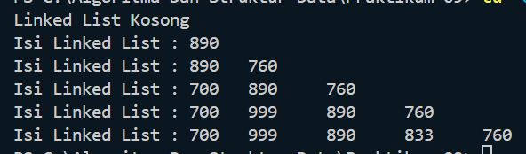
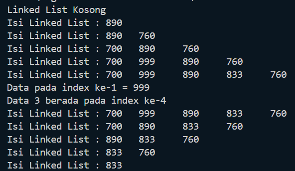
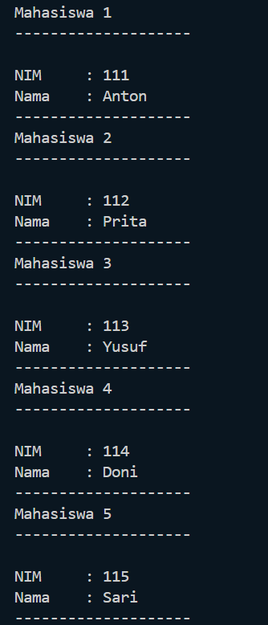
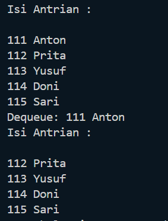

# Laporan Praktikum 10
<b>NAMA : Octrian Adiluhung TIto Putra<b> 
<b>KELAS : TI-1H<b> 
<b>ABSEN : 22<b> 
<b>NIM : 2341720078<b> 
 

## Percobaan 1 : Pembuatan Single Linked List
### OUTPUT
 

 
Pertanyaan
 
1. Mengapa hasil compile kode program di baris pertama menghasilkan “Linked List Kosong”? 
> Karena tidak ada nilai pada list tersebut alias kosong
  
2. Jelaskan kegunaan variable temp secara umum pada setiap method! 
> Variabel temp secara umum digunakan untuk menyimpan data dari salah satu penyimpanan untuk dilakukan perpindahan node.
  
3. Perhatikan class SingleLinkedList, pada method insertAt Jelaskan kegunaan kode berikut  
> Kode tersebut digunakan untuk mengecek apakah node yang akan ditambahkan merupakan node terakhir. Jika iya, tail akan diubah jadi node baru
  

## Percobaan 2 : Modifikasi Elemen pada Single Linked List
### OUTPUT
 

 
Pertanyaan
 
1. Mengapa digunakan keyword break pada fungsi remove? Jelaskan!  
> Menggunakan keyword break pada fungsi remove membuat program langsung keluar dari perulangan ketika kondisi tertentu terpenuhi
  
2. Jelaskan kegunaan kode dibawah pada method remove  
> Kode tersebut digunakan ketika data selanjutnya merupakan key yang akan dihapus sehingga data tersebut akan ditumpuk dengan data setelah key tersebut.
  

## Latihan Praktikum
 
Buatlah implementasi program antrian layanan unit kemahasiswaan sesuai dengan kondisi yang ditunjukkan pada soal nomor 1! Ketentuan :  
a. Implementasi antrian menggunakan Queue berbasis Linked List! 
b. Program merupakan proyek baru, bukan modifikasi dari soal nomor 1! 

### OUTPUT TUGAS 1
 

 

### OUTPUT TUGAS 2
 

 
