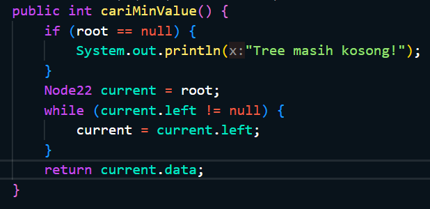
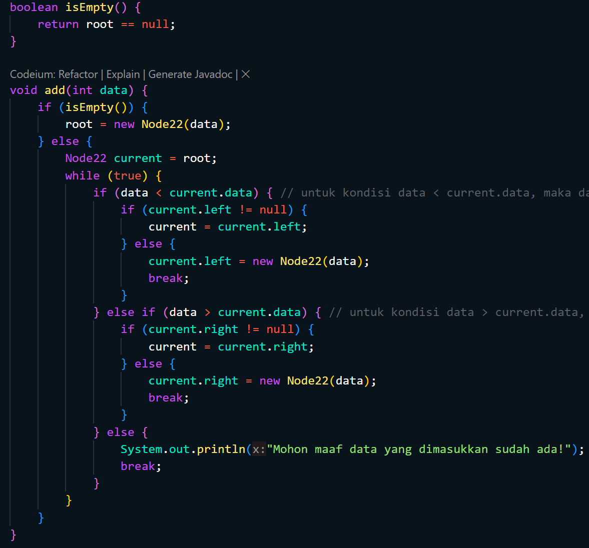

# Laporan Praktikum 11
<b>NAMA : Octrian Adiluhung TIto Putra<b> 
<b>KELAS : TI-1H<b> 
<b>ABSEN : 22<b> 
<b>NIM : 2341720078<b> 
 

## Percobaan 1 
### OUTPUT
 

 
Pertanyaan
 
1. Mengapa dalam binary search tree proses pencarian data bisa lebih efektif dilakukan dibanding 
binary tree biasa?  
- Karena hanya perlu melakukan pencarian pada bagian elemen tertentu (jika lebih kecil akan mencari di elemen sebelah kiri, jika lebih besar akan mencari disebelah kanan
  
2. Untuk apakah di class Node, kegunaan dari atribut left dan right?  
- left digunakan untuk menunjukkan child sebelah kiri, right digunakan untuk menunjuk child sebelah kanan
  
3. a. Untuk apakah kegunaan dari atribut root di dalam class BinaryTree?  
- Digunakan untuk menunjuk elemen pertama dari sebuah Tree
 
b. Ketika objek tree pertama kali dibuat, apakah nilai dari root?  
- Ketika pertama dibuat, root akan bernilai null yang mengindikasikan bahwa Tree masih kosong
  
4. Ketika tree masih kosong, dan akan ditambahkan sebuah node baru, proses apa yang akan terjadi?  
- Node baru akan menjadi root dari Tree
  
5. Perhatikan method add(), di dalamnya terdapat baris program seperti di bawah ini. Jelaskan 
secara detil untuk apa baris program tersebut?  
- if(data < current.data) : digunakan untuk mengecek apakah data yang dicari lebih kecil dari current data yang sedang dicek   
if(current.left!=null) : Mengecek apakah current memiliki left child
current = current.left; , jika memiliki, akan memindahkan current menjadi left child dari current 
} else, jika node tidak memiliki left child
current.left = new Node(data); membuat node baru menjadi left child dari current
break; , menghentikan perulangan setelah data ditambahkan
  

## Percobaan 2
### OUTPUT
 

 
Pertanyaan
 
1. Apakah kegunaan dari atribut data dan idxLast yang ada di class BinaryTreeArray?  
- Data digunakan untuk menampung nilai/data dari node dalam Tree
idxLast digunakan untuk menampung indeks node terakhir
  
2. Apakah kegunaan dari method populateData()?  
- PopulateData() digunakan untuk mengisi array berdasarkan Binary Tree dan juga menentukan idxLast
  
3. Apakah kegunaan dari method traverseInOrder()?  
- TraverseInOrder() digunakan untuk menampilkan/print node secara in-order (kiri, root, kanan)
  
4. Jika suatu node binary tree disimpan dalam array indeks 2, maka di indeks berapakah posisi 
left child dan rigth child masin-masing?  
- Jika node disimpan di indeks 2, left child ada di indeks 5 (2*2+1) dan right child ada di indeks 6 (2*2+2).
  
5. Apa kegunaan statement int idxLast = 6 pada praktikum 2 percobaan nomor 4?  
- int idxLast = 6 Digunakan untuk menunjukkan bahwa elemen terakhir ada di indeks 6
  

## Latihan Praktikum
 
1. Buat method di dalam class BinaryTree yang akan menambahkan node dengan cara 
rekursif.  
 

  
2. Buat method di dalam class BinaryTree untuk menampilkan nilai paling kecil dan yang 
paling besar yang ada di dalam tree.  
 

 

  
3. Buat method di dalam class BinaryTree untuk menampilkan data yang ada di leaf.  

  
4. Buat method di dalam class BinaryTree untuk menampilkan berapa jumlah leaf yang ada 
di dalam tree.  

  
5. Modifikasi class BinaryTreeArray, dan tambahkan :   
• method add(int data) untuk memasukan data ke dalam tree   

  
• method traversePreOrder() dan traversePostOrder()  

  

### OUTPUT TUGAS 1
 

 

### OUTPUT TUGAS 2
 

 