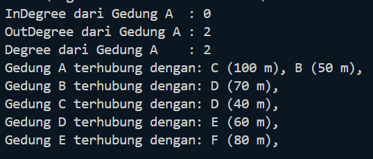
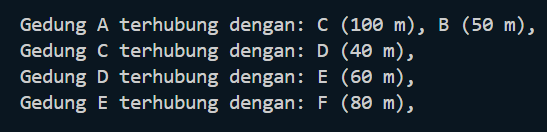
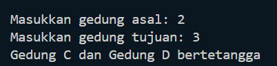
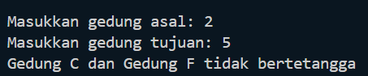
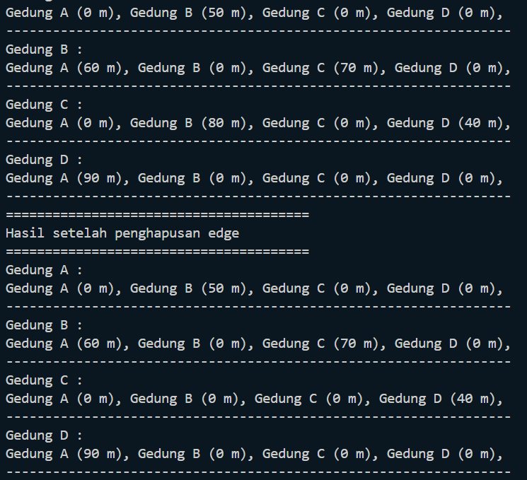
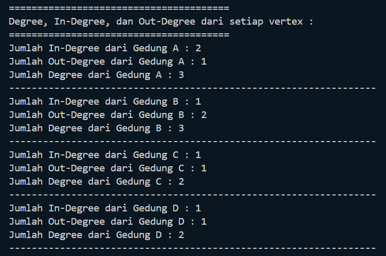
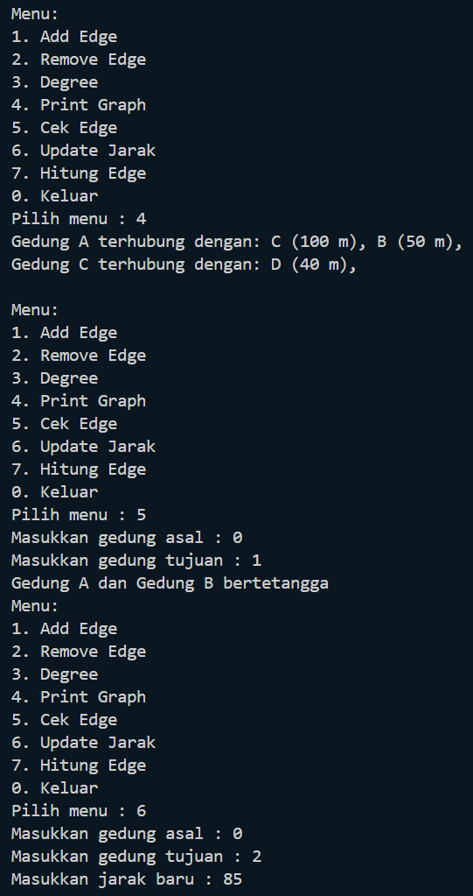
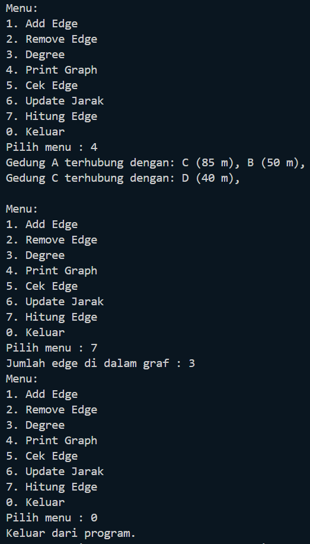
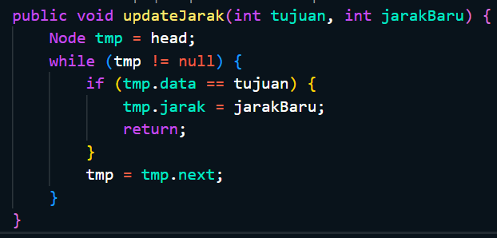
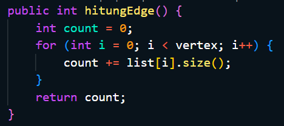

# Laporan Praktikum 12
<b>NAMA : Octrian Adiluhung TIto Putra<b> 
<b>KELAS : TI-1H<b> 
<b>ABSEN : 22<b> 
<b>NIM : 2341720078<b> 
 

## Percobaan 1 
### OUTPUT
 
  
 
 
Pertanyaan
 
1. Perbaiki kode program Anda apabila terdapat error atau hasil kompilasi kode tidak sesuai!  
2. Pada class Graph, terdapat atribut list[] bertipe DoubleLinkedList. Sebutkan tujuan pembuatan
variabel tersebut!  
- list[] digunakan untuk menyimpan data dari setiap vertex dalam graph
  
3. Jelaskan alur kerja dari method removeEdge! 
- Menerima dua parameter asal dan tujuan, melakukan iterasi melalui semua vertex, pada saat iterasi jika vertex i sama dengan tujuan maka kode akan menghapus tujuan dari daftar vertex asal menggunakan remove(tujuan) pada doublelinkedlist yang menyimpan tetangga vertex asal
  
4. Apakah alasan pemanggilan method addFirst() untuk menambahkan data, bukan method add
jenis lain saat digunakan pada method addEdge pada class Graph?  
- Untuk memastikan penambahan data baru yang cepat dan efisien tanpa memerlukan traversal tambahan
  
5. Modifikasi kode program sehingga dapat dilakukan pengecekan apakah terdapat jalur antara
suatu node dengan node lainnya, seperti contoh berikut (Anda dapat memanfaatkan Scanner).  
  

  

## Percobaan 2
### OUTPUT
 

 
Pertanyaan
 
1. Perbaiki kode program Anda apabila terdapat error atau hasil kompilasi kode tidak sesuai!   
2. Apa jenis graph yang digunakan pada Percobaan 2?  
- Graph Matrix
  
3. Apa maksud dari dua baris kode berikut?  
- Membuat edge dari gedung B ke gedung C dengan jarak 70m dan gedung C ke gedung B dengan jarak 80m
  
4. Modifikasi kode program sehingga terdapat method untuk menghitung degree, termasuk
inDegree dan outDegree!  

  

## Latihan Praktikum
 
1. Modifikasi kode program pada class GraphMain sehingga terdapat menu program yang bersifat
dinamis, setidaknya terdiri dari: 
a) Add Edge  
b) Remove Edge 
c) Degree 
d) Print Graph 
e) Cek Edge 
Pengguna dapat memilih menu program melalui input Scanner  
 
  
  

  
2. Tambahkan method updateJarak pada Percobaan 1 yang digunakan untuk mengubah jarak
antara dua node asal dan tujuan!  
 

  
3. Tambahkan method hitungEdge untuk menghitung banyaknya edge yang terdapat di dalam graf!  

  
